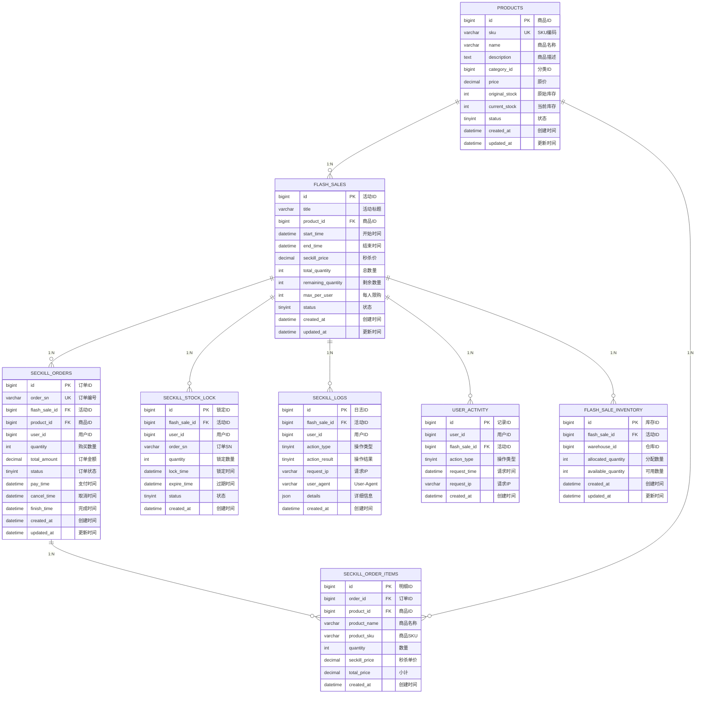
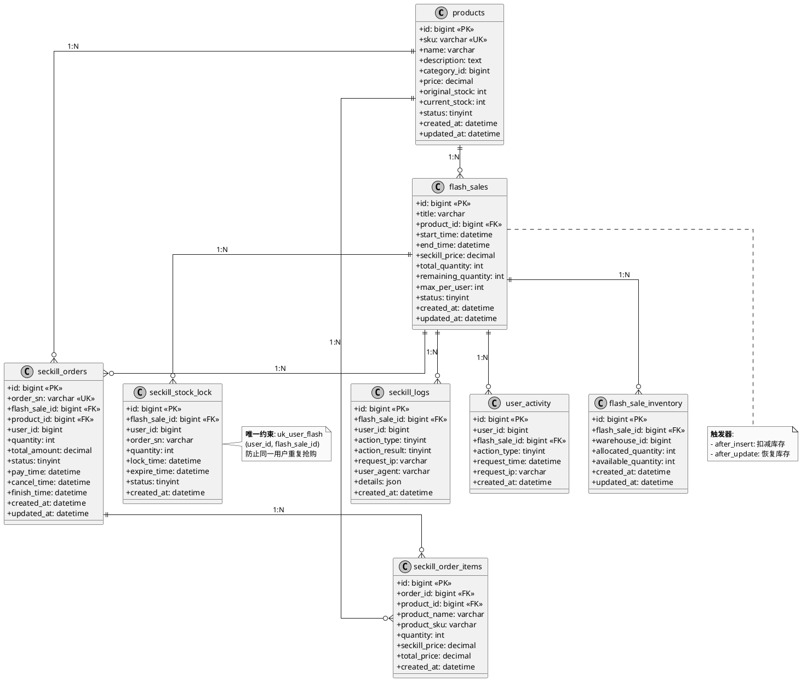

# 秒杀系统数据库 ER 图

## Mermaid ER 图



---

## 表关系说明

### 核心业务流程关系

```
┌─────────────┐      ┌─────────────────┐      ┌─────────────────┐
│  products   │◄─────┤  flash_sales    │◄─────┤ seckill_orders  │
│   (商品)    │ 1:N  │   (秒杀活动)     │ 1:N  │   (秒杀订单)     │
└─────────────┘      └─────────────────┘      └─────────────────┘
                              │
              ┌───────────────┼───────────────┐
              │               │               │
              ▼               ▼               ▼
┌──────────────────┐ ┌──────────────┐ ┌────────────────┐
│seckill_stock_lock│ │ seckill_logs │ │  user_activity │
│   (库存锁定)      │ │  (操作日志)   │ │  (行为追踪)     │
└──────────────────┘ └──────────────┘ └────────────────┘
```

---

## 外键关系明细

| 主表 | 子表 | 外键字段 | 关系类型 | 说明 |
|------|------|----------|----------|------|
| **products** | flash_sales | product_id | 1:N | 一个商品可参与多次秒杀 |
| **products** | seckill_orders | product_id | 1:N | 一个商品可产生多个订单 |
| **products** | seckill_order_items | product_id | 1:N | 一个商品可出现在多个订单项 |
| **flash_sales** | seckill_orders | flash_sale_id | 1:N | 一个活动可产生多个订单 |
| **flash_sales** | seckill_stock_lock | flash_sale_id | 1:N | 一个活动可有多个库存锁定 |
| **flash_sales** | seckill_logs | flash_sale_id | 1:N | 一个活动产生多条日志 |
| **flash_sales** | user_activity | flash_sale_id | 1:N | 一个活动有多个用户行为 |
| **flash_sales** | flash_sale_inventory | flash_sale_id | 1:N | 一个活动分布在多个仓库 |
| **seckill_orders** | seckill_order_items | order_id | 1:N | 一个订单包含多个商品项 |

---

## 唯一约束

| 表名 | 唯一约束 | 字段 | 说明 |
|------|----------|------|------|
| products | uk_sku | sku | SKU唯一 |
| seckill_orders | uk_order_sn | order_sn | 订单号唯一 |
| seckill_stock_lock | uk_user_flash | user_id + flash_sale_id | **防止重复抢购** |
| flash_sale_inventory | uk_flash_warehouse | flash_sale_id + warehouse_id | 活动+仓库唯一 |

---

## PlantUML 版本



---

## 使用说明

### 1. Mermaid 渲染
在支持 Mermaid 的 Markdown 编辑器（如 VS Code + Mermaid 插件、GitHub）中直接查看。

### 2. PlantUML 渲染
- 在线工具：[plantuml.com/plantuml](https://plantuml.com/plantuml)
- VS Code 插件：PlantUML
- IntelliJ 插件：PlantUML integration

### 3. 导出图片
使用 PlantUML 可以导出 PNG/SVG/PDF 格式：
```bash
# 命令行导出
java -jar plantuml.jar er-diagram.puml -tpng
java -jar plantuml.jar er-diagram.puml -tsvg
```

---

## 关键设计亮点

| 设计点 | 实现方式 | 优势 |
|--------|----------|------|
| **防重复抢购** | seckill_stock_lock.uk_user_flash | 数据库唯一约束，原子性保证 |
| **库存一致性** | 触发器自动扣减/恢复 | 避免应用层遗漏 |
| **高并发查询** | 12+战略索引 | 覆盖所有热查询 |
| **审计追踪** | seckill_logs + user_activity | 完整操作链路 |
| **扩展性** | 可选的多仓库/多商品支持 | 未来业务扩展 |
